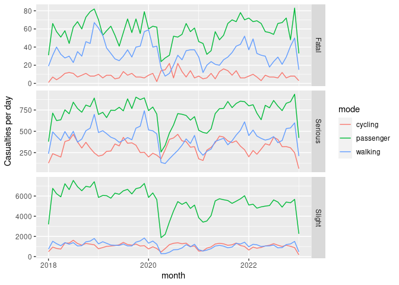
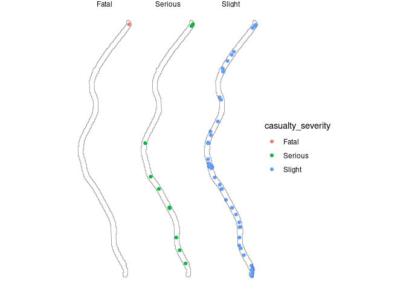

# Road traffic casualties

``` r
library(tidyverse)
library(sf)
remotes::install_dev("stats19")
library(stats19)
```

Data was obtained from the DfT’s STATS19 data releases using the
`stats19` R package. The data is available for download from the [DfT
website](https://data.gov.uk/dataset/road-accidents-safety-data). The
data is available in two forms: as a single file for each year, and as a
single file for each type of data (e.g. collisions, casualties,
vehicles) for all years. The latter is more convenient for analysis, but
the former is more convenient for downloading. The `stats19` package
provides functions to download the data in both forms.

The last 5 years of data for the ‘collisions’ and ‘casualties’ tables
were downloaded in the first instance. They have the following column
names:

``` r
collisions = get_stats19("collision", year = "5-years")
casualties = get_stats19("casualty", year = "5-years")
names(collisions)
```

     [1] "accident_index"                             
     [2] "accident_year"                              
     [3] "accident_reference"                         
     [4] "location_easting_osgr"                      
     [5] "location_northing_osgr"                     
     [6] "longitude"                                  
     [7] "latitude"                                   
     [8] "police_force"                               
     [9] "accident_severity"                          
    [10] "number_of_vehicles"                         
    [11] "number_of_casualties"                       
    [12] "date"                                       
    [13] "day_of_week"                                
    [14] "time"                                       
    [15] "local_authority_district"                   
    [16] "local_authority_ons_district"               
    [17] "local_authority_highway"                    
    [18] "first_road_class"                           
    [19] "first_road_number"                          
    [20] "road_type"                                  
    [21] "speed_limit"                                
    [22] "junction_detail"                            
    [23] "junction_control"                           
    [24] "second_road_class"                          
    [25] "second_road_number"                         
    [26] "pedestrian_crossing_human_control"          
    [27] "pedestrian_crossing_physical_facilities"    
    [28] "light_conditions"                           
    [29] "weather_conditions"                         
    [30] "road_surface_conditions"                    
    [31] "special_conditions_at_site"                 
    [32] "carriageway_hazards"                        
    [33] "urban_or_rural_area"                        
    [34] "did_police_officer_attend_scene_of_accident"
    [35] "trunk_road_flag"                            
    [36] "lsoa_of_accident_location"                  
    [37] "datetime"                                   

``` r
names(casualties)
```

     [1] "accident_index"                     "accident_year"                     
     [3] "accident_reference"                 "vehicle_reference"                 
     [5] "casualty_reference"                 "casualty_class"                    
     [7] "sex_of_casualty"                    "age_of_casualty"                   
     [9] "age_band_of_casualty"               "casualty_severity"                 
    [11] "pedestrian_location"                "pedestrian_movement"               
    [13] "car_passenger"                      "bus_or_coach_passenger"            
    [15] "pedestrian_road_maintenance_worker" "casualty_type"                     
    [17] "casualty_home_area_type"            "casualty_imd_decile"               
    [19] "lsoa_of_casualty"                  

We’ll join the casualties and collisions tables together, and then
filter to only include pedestrian and cycling casualties.

``` r
cas_types = casualties %>%
  select(accident_index, casualty_type, casualty_severity) %>%
  mutate(n = 1) %>%
  group_by(accident_index, casualty_type, casualty_severity) %>%
  summarise(n = sum(n)) %>%
  tidyr::spread(casualty_type, n, fill = 0)
cas_joined = left_join(collisions, cas_types, by = "accident_index")
```

Let’s plot the result:

``` r
crashes_dates = cas_joined %>% 
  mutate(month = lubridate::round_date(date, "month")) %>%
  group_by(month, casualty_severity) %>% 
  summarise(
    walking = sum(Pedestrian),
    cycling = sum(Cyclist),
    passenger = sum(`Car occupant`)
    ) %>% 
  tidyr::gather(mode, casualties, -casualty_severity, -month)
ggplot(crashes_dates, aes(month, casualties)) +
  geom_line(aes(colour = mode)) +
  ylab("Casualties per day") +
  facet_grid(casualty_severity ~ ., scales = "free_y") 
```



To get the data in geographic form and plot results for a particular
road, we can do the following:

``` r
collisions_sf = format_sf(collisions)
collisions_sf = st_transform(collisions_sf, "EPSG:4326")
cas_sf = left_join(collisions_sf, cas_types, by = "accident_index")
osm_data_leeds = osmextract::oe_get("Leeds")
```

    Reading layer `lines' from data source `/home/robin/data/osm/bbbike_Leeds.gpkg' using driver `GPKG'
    Simple feature collection with 169441 features and 9 fields
    Geometry type: LINESTRING
    Dimension:     XY
    Bounding box:  xmin: -1.889999 ymin: 53.65 xmax: -1.280002 ymax: 53.88
    Geodetic CRS:  WGS 84

``` r
scott_hall_road = osm_data_leeds |>
  filter(name == "Scott Hall Road") 
# plot(scott_hall_road)
scott_hall_buffer = st_buffer(st_union(scott_hall_road), 30)
crashes_scott_hall = cas_sf[scott_hall_buffer, ]
ggplot(crashes_scott_hall) +
  geom_sf(aes(colour = casualty_severity)) +
  geom_sf(data = scott_hall_buffer, fill = NA) +
  facet_wrap(~casualty_severity) +
  theme_void()
```



We can output the data as follows:

``` r
st_write(crashes_scott_hall, "crashes_scott_hall.geojson", delete_dsn = TRUE)
```

    Deleting source `crashes_scott_hall.geojson' using driver `GeoJSON'
    Writing layer `crashes_scott_hall' to data source 
      `crashes_scott_hall.geojson' using driver `GeoJSON'
    Writing 64 features with 58 fields and geometry type Point.

<!-- Testing on the raw data -->
